# **Quick Bill**

## Table of Contents
1. Features
2. Technology Stack
3. Database Structure
4. Installation Guide
5. How to Prepare the Database
6. License

## Features
Quick Bill is the best ticket management application on the market. Users can buy tickets, view their available tickets, and check expired ones to keep track of their tickets usage efficiently. Administrators can manage the system by adding new providers, specifying locations, defining transport types, and creating ticket types with custom expiration times. This allows administrators to configure and maintain the system’s transportation options and ticketing rules, ensuring the system meets operational needs.

## Technology Stack
- **Frontend**: HTML, CSS, JavaScript
- **Backend**: PHP
- **Database**: PostgreSQL
- **Containerization**: Docker
- **Web Server**: Nginx

## Database Structure
The database schema is represented by the following diagram:

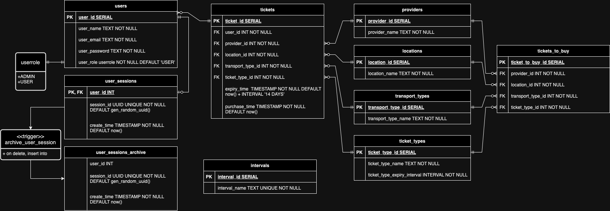

## Installation Guide
To set up the application locally, follow these steps:

1. Clone the repository to your local machine:
    ```
    git clone https://github.com/Grelory/WDPAI.git
    ```
2. Navigate to the project directory:
    ```
    cd WDPAI/WDPAI_DOCKER
    ```
3. Build and run the Docker containers:
    ```
    docker-compose build
    docker-compose up
    ```

## How to Prepare the Database
1. Log in to **pgAdmin** by visiting [http://localhost:5050](http://localhost:5050).
2. Use the following credentials to log in:
    - Username: `admin@example.com`
    - Password: `admin`
3. Once logged in, open the **Query Tool** from the navigation menu.
4. Copy the SQL file **`WDPAI/WDPAI_DOCKER/db-scripts/database.sql`** and execute it in the query tool.

## Demo
### Authorization:
- **`/auth/login`** - Login screen for all users and administrators.
- **`/auth/registration`** - Registration screen where users can create an account with the "USER" role.
- **`/auth/logout`** - Logout screen for all users and administrators.

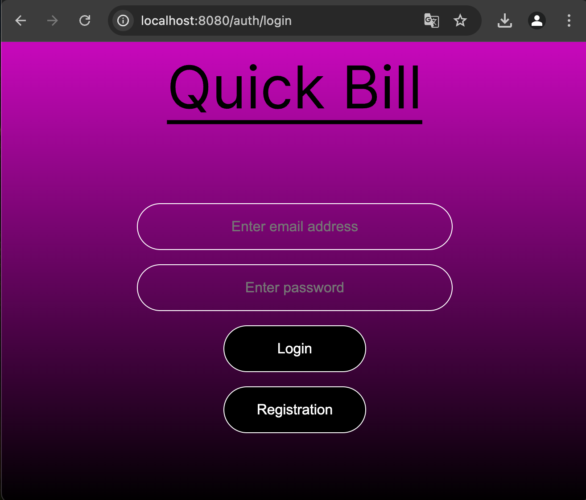 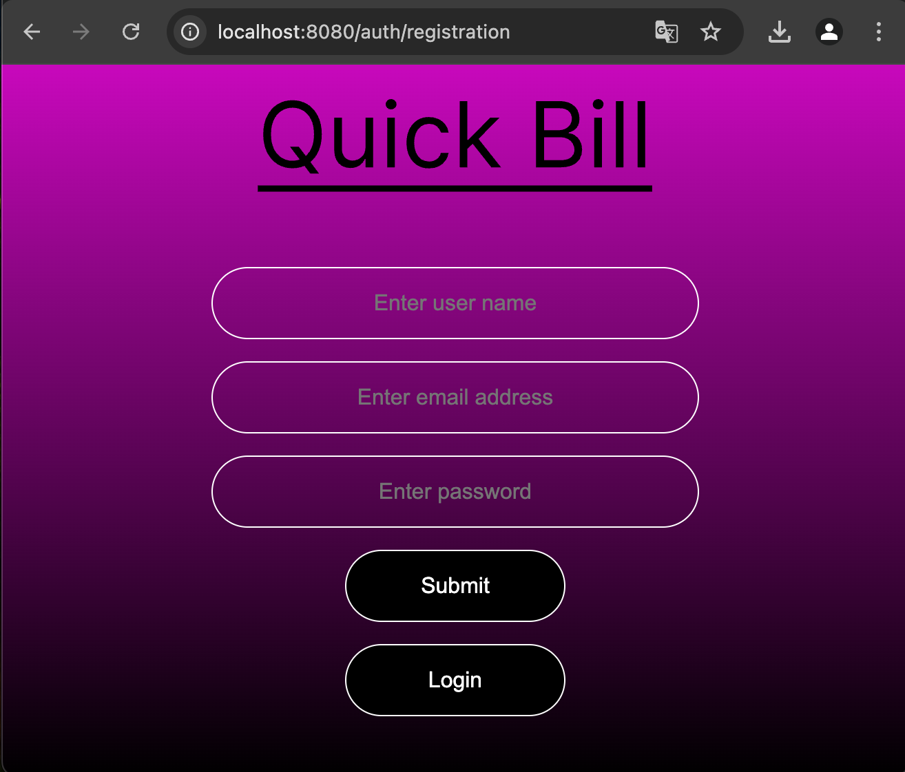 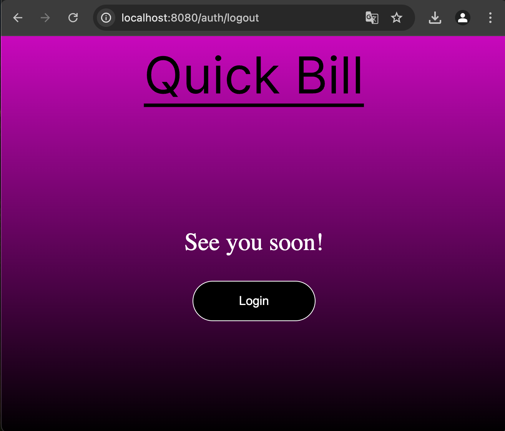

### User: ('USER' role is required)
- **`/user/dashboard`** - Welcome screen that displays the user's name.
- **`/user/buy`** - Screen where users can purchase tickets by selecting the provider, location, transport type and ticket type.
- **`/user/available`** - Displays all active tickets bought by the user.
- **`/user/expired`** - Shows all tickets bought by the user that have passed the expiration date.

 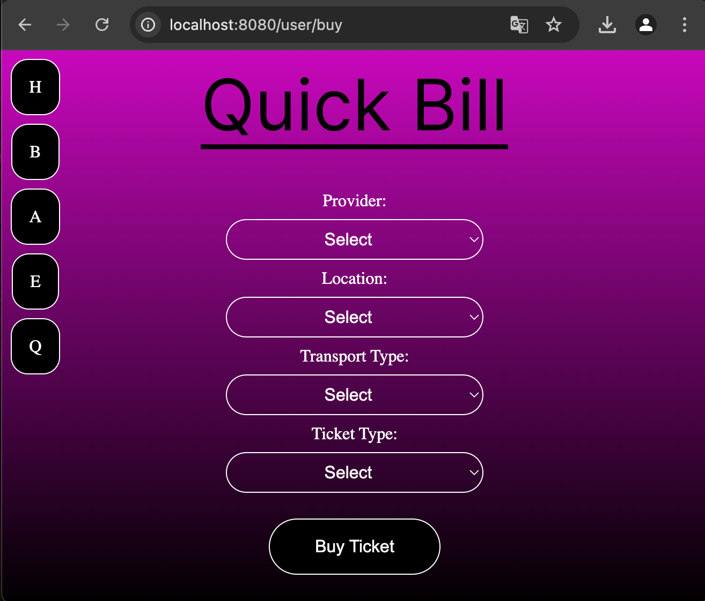 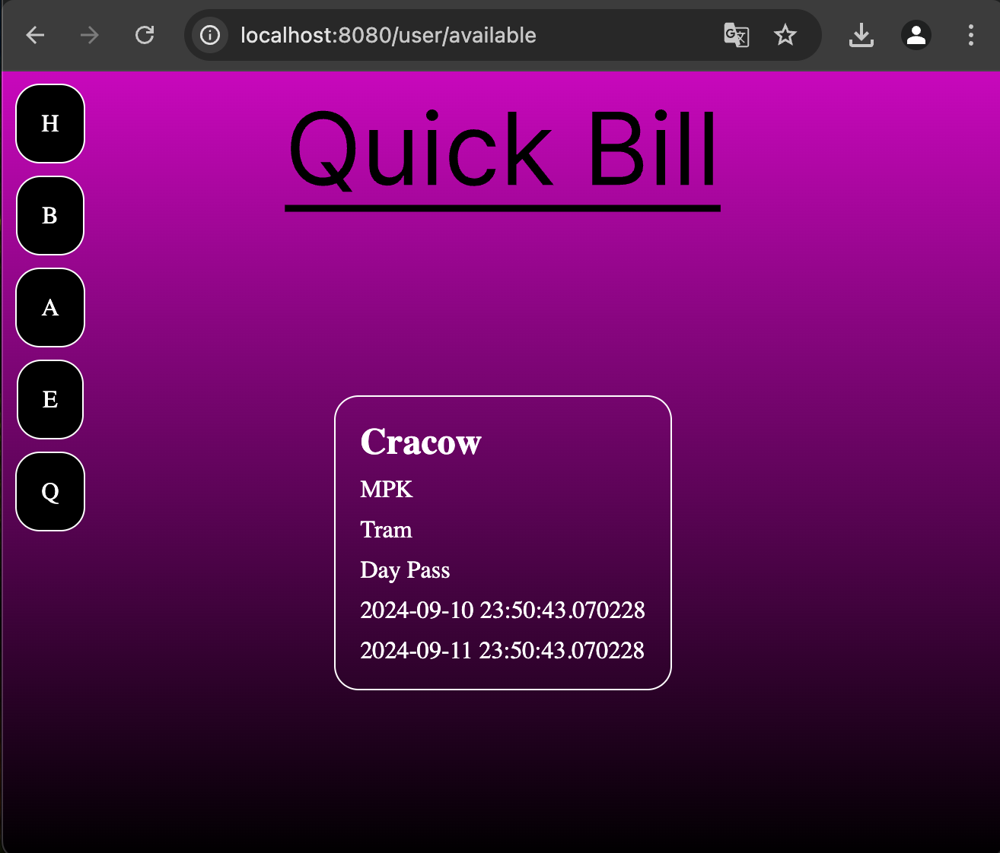 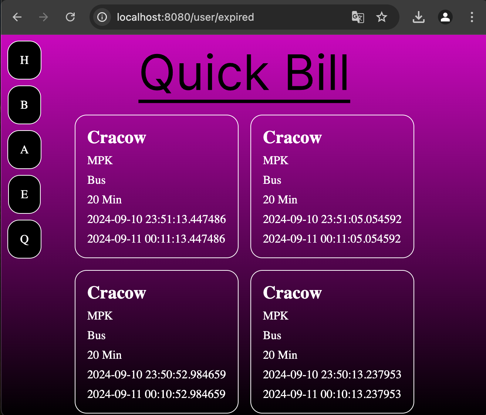

### User: ('ADMIN' role is required)
- **`/admin/dashboard`** - Welcome screen for administrators that displays the administrator's name.
- **`/admin/tickets`** - Screen where administrators can combine providers, locations, transport types, and ticket types to create "tickets to buy" for users.
- **`/admin/providers`** - Screen where administrators can add new providers.
- **`/admin/locations`** - Screen where administrators can add new locations.
- **`/admin/transport`** - Screen where administrators can add new transport types.
- **`/admin/types`** - Screen where administrators can add new ticket types and define their expiration times.

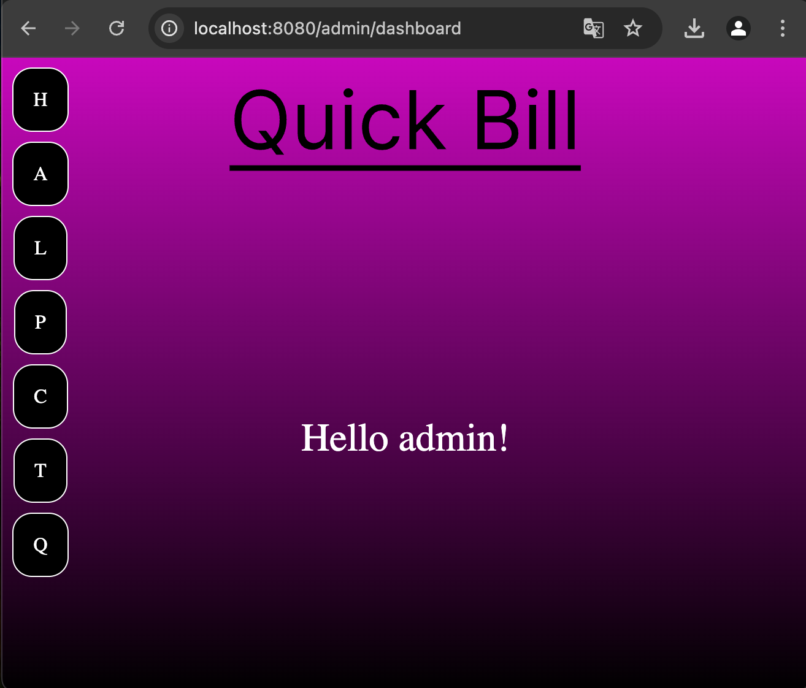 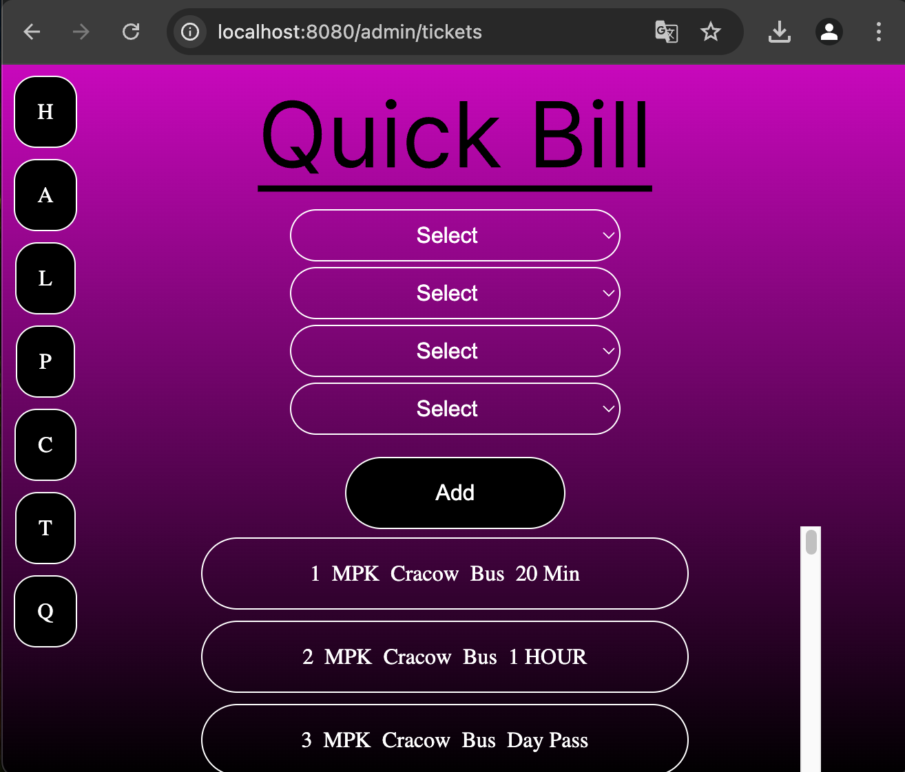 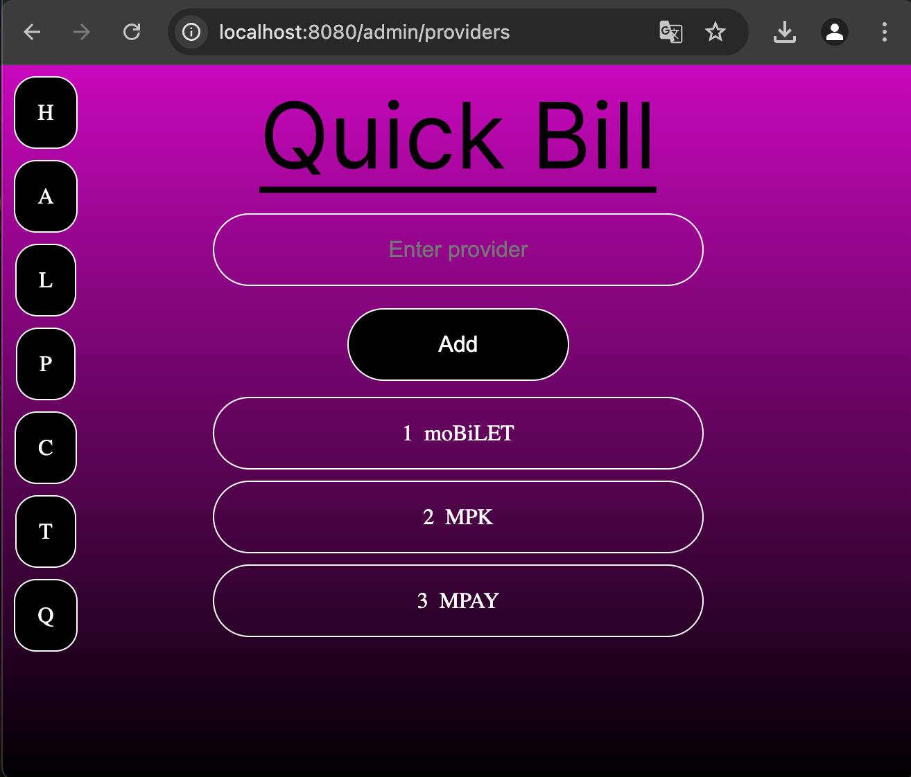 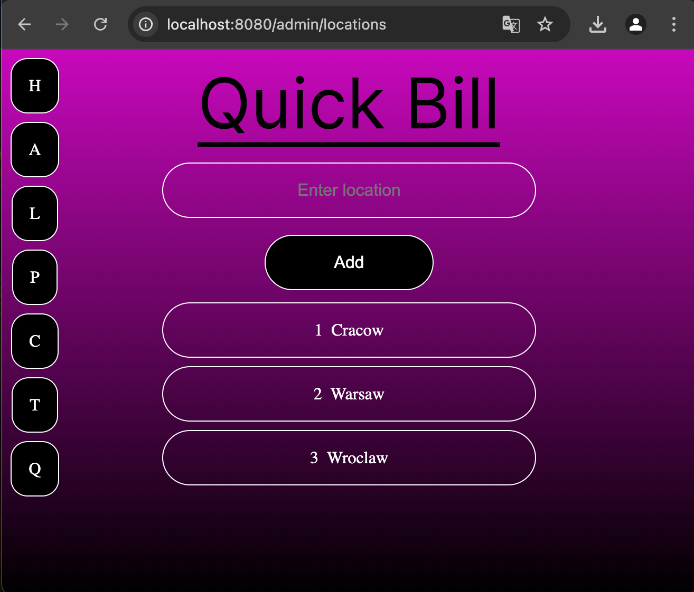  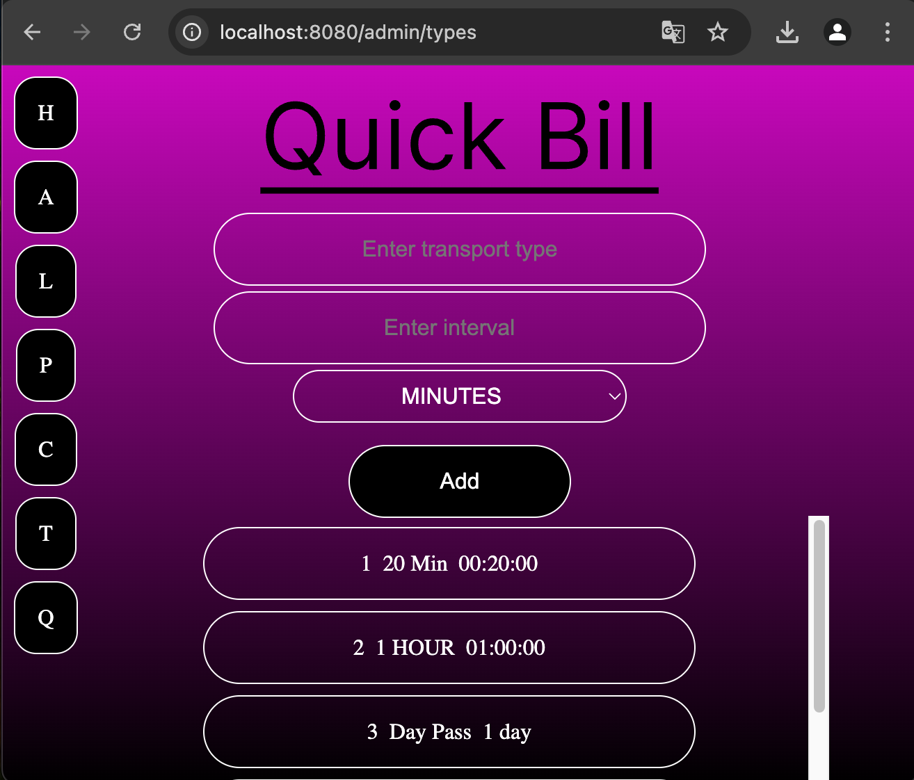

### Resources: 
- **`/resources/tickets/to-buy`** - REST endpoint that provides a list of all available tickets that users can buy. ('ADMIN' or 'USER' role is required)
- **`/resources/tickets/unmatched-to-buy`** - REST endpoint that provides sets of unmatched providers, locations, transport types, and ticket types which administrators can combine to create "tickets to buy" for users. ('ADMIN' role is required)

## License
This project is licensed under the MIT License. See the [LICENSE](LICENSE) file for details.
